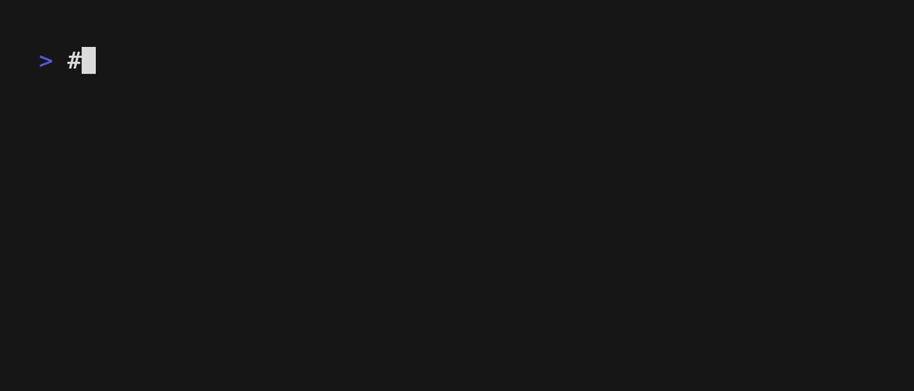
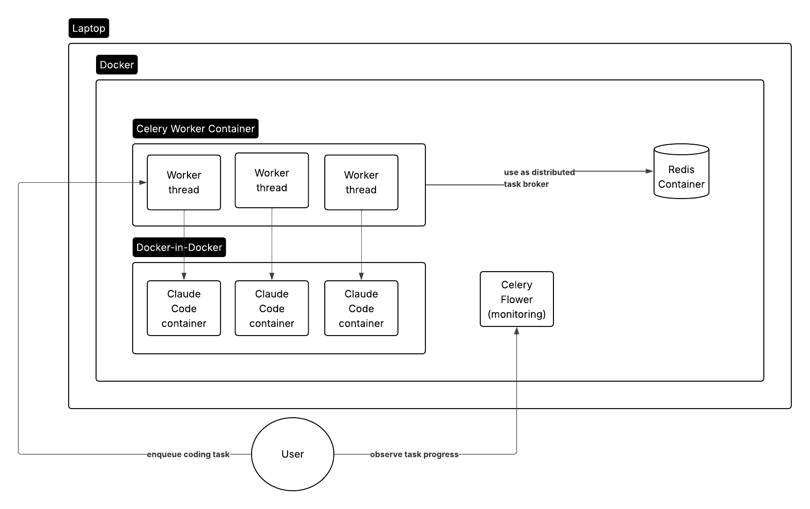

# PatchStorm

PatchStorm is a lightweight service for scaling out changes across many repositories. 
It uses coding agents, GitHub search, and distributed task processing to streamline everything from
version bumps to complex refactors.

This project is under active development. We need contributors! 
If you would like to contribute, please contact @wontonst

# Setup

* Install the GitHub cli and run `gh auth login -s project,workflow`
  * project is used for tagging the PR with a tracking board so you can see them all in one place
  * workflow is used to be able to create commits that modify the github action yml files
* Create `.env.configs` by running `cp env.example .env.configs` and fill in the values
  * the project tags the PRs with a tracking board so if you generate 100 PRs you can see them all in one place
  * the organization is used to conduct code searches
* Add credentials for your LLM provider
  * Codex: add `OPENAI_API_KEY=[your key]` to `.env.configs`
  * Claude Code - two options
    1. Enable claude 3.7 and 3.5 in your AWS account's Bedrock settings, then add your AWS credentials to `.env.custom`
    2. Add ANTHROPIC_API_KEY=[your key] to `.env.configs`

## Dynamic credentials

If you use short-lived credentials (e.g. from AWS SSO), you can create a script in the root directory called
`custom_setup.sh` that will write key value pairs to .env.custom. This script will get called by the Makefile.

e.g.

```
#!/bin/bash
fetch-aws-credentials --profile my-profile > .env.custom
```

# Getting started

Once you have completed setup, run `make up` to bring up all the PatchStorm services.
Wait for a minute or so for internal images to finish building.

The simplest way to issue a coding prompt to an agentic AI that will clone down a repo, perform changes, and commit any changes:



```
docker compose exec worker python run_agent.py --prompt "PROMPT HERE" --commit-msg "COMMIT MESSAGE HERE" --repos org/repo1
# See available options with:
docker compose exec worker python run_agent.py --help
```

You can also create a task definition file instead of passing configs through the command line

Run `docker compose exec worker python run_agent.py --help` to see available options. These parameters are
mirrored in the task definition file format.

Note that with task definitions you can define multiple prompts. The agent will run through each prompt
sequentially while maintaining the same session.

```
agent:
  provider: claude_code|codex
commit:
  message: "commit message, eg chore: upgrade to fogg 0.92.27"
repos:
  include:
    - "chanzuckerberg/fogg"
  exclude:
    - "chanzuckerberg/some-other-repo"
  search_query: '"set up working directory by installing dependencies"'
prompts:
  - prompt: "update the version string in .fogg-version to 0.92.27. If you edit the version string, make sure the makefile setup target is downloading the correct fogg version."
  - prompt: "in the root fogg.yml file, if there are any self references to the repo using a git url pinned to the main branch instead of a relative path, change it to use a relative path instead."
```

When you have written a task definition, you can use this shortcut:

```
./shortcut.sh [path to task definition]
# with additional override flags
./shortcut.sh [path to task definition] --commit-msg "Upgrade Fogg to latest version" --dry
```

The order of operations for the repos block is the union of the include list and the search query,
minus any repos in the exclude list.

## Make Targets

The project includes a Makefile with helpful commands for managing the Docker Compose stack:

```bash
# Start the stack
make up
# Wait for a minute or so for the build_claud_img container to finish building the claude runner image within the stack

# You can view its progress and other logs using
make logs
# To only view logs for the worker you can use
make logs-worker

# Shell into the worker instance
make sh

# Stop the stack
make down

# Restart services without rebuilding
make restart

# Rebuild and restart
make rebuild

# Full cleanup
make clean
```

## Monitoring and Management

DO NOT NOT USE THIS OUTSIDE OF YOUR LAPTOP.
This system has NOT been hardened (yet).

- Flower for monitoring Celery tasks. View using `make openflower`

## Architecture



# Code of Conduct

This project adheres to the Contributor Covenant [code of conduct](https://github.com/chanzuckerberg/.github/blob/master/CODE_OF_CONDUCT.md). By participating, you are expected to uphold this code. Please report unacceptable behavior to [opensource@chanzuckerberg.com](mailto:opensource@chanzuckerberg.com).

# Reporting Security Issues

If you believe you have found a security issue, please responsibly disclose by contacting us at [security@chanzuckerberg.com](mailto:security@chanzuckerberg.com).
